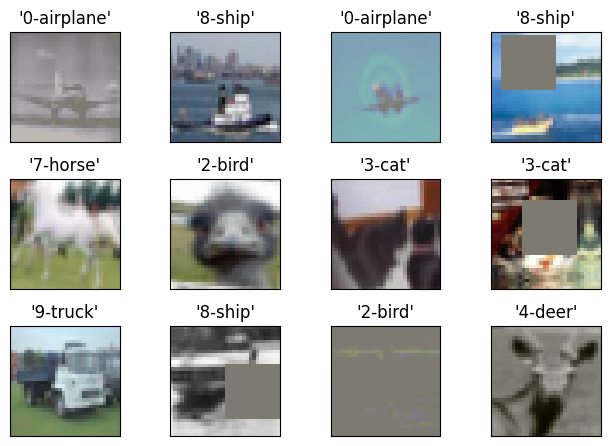
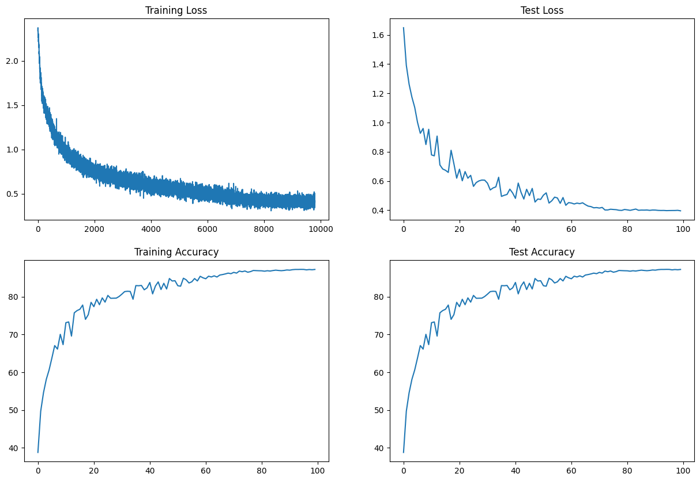
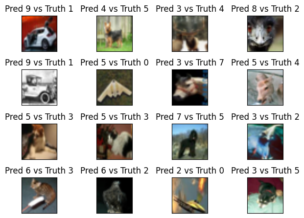
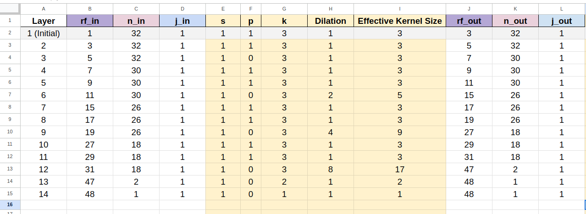
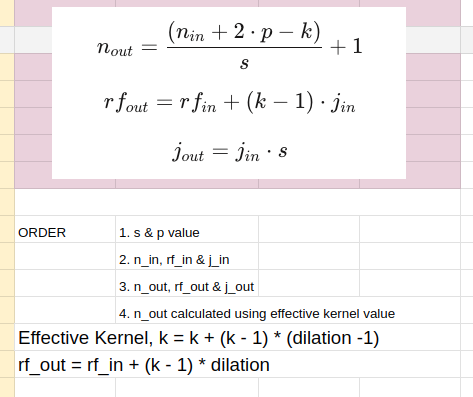

# S9 - Neural Network Image Classification - Dilated Convolutions and Depthwise Separable Convolutions - CIFAR10 DataSet
This is the repository which contains the assignment work of Session 9

## Description

This project includes 7 Python files: `abstract_dataset.py`, `utils.py`, 'back_propogation.py', 'cifar10_dataset.py', 'model.py', 'model_training.py', 'scheduler.py' and one notebook `S9.ipynb'. These files are part of a machine learning project for image classification using the CIFAR10 dataset. The project is about training a neural network model to recognize images using less than 200K parameters, and with test accuracy equal to or greater than 85% using dilated convolutions and depthwise separable convolutions.

Few samples in the dataset are shown below.




## Files

### 1. model.py

This file 'model.py' defines a neural network architecture using PyTorch. It consists of two classes: convLayer and Net. This network architecture uses **Dilated convolution (1, 2, 4, 8) + Depth wise Separable Convolution + Skip Connections** to achieve the goal of receptive field>44, parameter count <= 200K. The convLayer class represents a convolutional layer with customizable parameters such as input channels, output channels, bias, padding, depthwise separable convolution, skip connections, dilation, and dropout. It initializes the layers required for the convolutional operation and provides a forward method to perform the convolution and apply normalization, activation, and dropout if specified. 

The Net class represents the main neural network architecture. It inherits from the nn.Module class and defines the layers and forward method for the network. It consists of several convBlock and transitionBlock layers, followed by an outblock layer. Each convBlock represents a sequence of convolutional layers defined by the convLayer class. Similarly, each transitionBlock represents a single convolutional layer. The outblock is the final block in the network that performs adaptive average pooling, followed by a convolutional layer, flattening, and log-softmax activation. 

The Net class also includes a summary method that uses the torchinfo.summary function to generate a summary of the network architecture, including input and output sizes, the number of parameters, kernel sizes, and computational statistics.

Overall, this code implements a neural network with multiple convolutional layers and skip connections. The network architecture is modular and allows customization of various parameters to create different configurations of the network.

To run this code, you can create an instance of the Net class, pass input data through the network using the forward method, and utilize the summary method to get a summary of the network architecture.

#### 1.1 Model Architecture [Dilated Convolution + Depthwise Separable Convolution + Skip Connection + Batch Normalization] Summary gave Parameter Count = 190,509 (Refer the S9.ipnb file for the summary)

### 2. back_propogation.py
This file also has **train** and **test** functions which return the train loss, train accuracy, test loss and test accuracy respectively.

### 3. utils.py

The `utils.py` file contains helper functions that are used throughout the project. These functions provide some common functionalities for data preprocessing, visualization, or any other necessary operations. It includes function to obtain the samples of mis-classifications (function: **get_incorrect_test_predictions**).

### 4. abstract_dataset.py

The `dataset.py` file contains the functionality to download the train and test data set with the batch size configuration based on whether the CUDA/GPU Is available for executing the models or not. The function **download_train_data** doewnloads the train data, the function **download_test_data** downloads the test dataset and the function **get_loader** prepares and returns the train_loader and test_loader that would get finally loaded into the models.

### 5. cifar10_dataset.py
The transformations that were tried on the train and test data was just to Normalize the image data. Applying Color related transformations or random cropping of the image and then resizing back to the dimension 32,32 or center cropping of the data did not help much in obtaining the desired accuracy of 70% when LN and GN were used. However the accuracy for BN crossed 70% for these image augmentations.

### 6. model_training.py

### 7. scheduler.py

### 8. S9.ipynb

The `S8_BN_LN_GN_models.ipynb` file is the notebook that has executions of various training models based on the network architectures Net_12, Net_13, Net_14 and Net_15 so as to execute the models right from scratch till we find the optimal model which gives 70%+ accuracy in less than 20 epochs using less than 50K parameters. 

#### 8.1. Descritpion of basic components in the notebook

This `S8_BN_LN_GN_models.ipynb`file contain code for training and evaluating a neural network model using the CIFAR10 dataset. These files include the following components:

- Importing necessary libraries and dependencies
- Mounting Google Drive
- Setting up the device (CPU or GPU)
- Defining data transformations for training and testing
- Loading the CIFAR10 dataset
- Setting up data loaders
- Displaying sample data from the training set
- Defining the neural network model and displaying its summary
- Training the model using SGD optimizer and NLL loss
- Displaying model training and testing statistics
- Displaying the incorrect test image predictions
- Defining an alternative neural network model (Model_1 to Model_9) and displaying its summary

In addition to the above components, each of these notebooks contain "Target-Results-Analysis" section for each of the models executed.

#### 8.2. Descritpion of CIFAR10 dataset

This data set consists of multiple images pertaining to 10 different classes. The following are the specifics of the 10 classes and the count of images in each of these classes.
['airplane',
 'automobile',
 'bird',
 'cat',
 'deer',
 'dog',
 'frog',
 'horse',
 'ship',
 'truck'] 

 {'frog': 5000,
 'truck': 5000,
 'deer': 5000,
 'automobile': 5000,
 'bird': 5000,
 'horse': 5000,
 'ship': 5000,
 'cat': 5000,
 'dog': 5000,
 'airplane': 5000}

#### 8.3 Description of the model

- Following are the target-result-analysis of the final best model for each of the BN techniques

#### 8.3.1 Code Block - Final Optimal Model

**Target:**

- Network Architecture - **Dilated Convolution + Depthwise Separable Convolution**
- Layer Structure - C1 C2 C3 C4 Output + No MaxPooling, all convolution blocks have 3 layers and use 3x3 convolutions, GAP + FC + 1x1 convolutions
- **Skip connections** used
- Batch Normalization used
- Image Augmentation using Albumentation Transforms - Color Jitter + To Gray + Horizontal flip + Shift Scale Rotate + Coarse Dropout
- Dropout of 0.05 and one cycle learning rate with max LR as 0.1 used
- L1 regularization degraded the performance and led the model to over-fitting, hence it is not used
- The receptive field we got with this network architecture is 48
- 
#### 8.3.2 Findings on the Normalization Techniques tried

**Results:**

- Parameters: 190.509K
- Best Train Accuracy: 86.19%
- Best Test Accuracy: 87.22% (95th Epoch)
- Test Accuracy: 85.39% (59th Epoch) [First occurrence of test accuracy above 85%]

**Analysis:**
- Model has no over fitting through out the training
- Scheduling OneCycle LR with pct_start = 0.4 gave better train/test accuracies trend in the first 100 epochs
  - Keeping the LR fixed at 0.1 did not show this kind of performance, the best   test accuracy achieved with in first 100 epochs is only 86.83%


#### 8.4 Graphs of the Normalization Techniques tried [Best Model plots shown below]

The following model statistics for the normalization techniques tried. These plots pertain to the performance of the final optimal model using architecture Net_15 and the other model specifics are highlighted below

##### 8.4.1 Final Optimal Model Training and Test Statistics - BN



#### 8.5 Collection of Mis-classified Predictions

The following image collection shows the mis-classified predictions for the normalization techniques tried. These images pertain to the preidctions made by the final optimal model (in S9.ipynb) using architecture Net and the other model specifics are highlighted below




##### 8.6 Images of RF Calculations and Formulae Used





Please note that this README serves as a placeholder. As I make further modifications to the project, I would keep this file updated accordingly. 

For more detailed information on the project's implementation and code, please refer to the individual files mentioned above.


## Usage

To run the project, make sure you have the dependencies installed.
```
pip install -r requirements.txt
```
You can execute the `S8.ipynb` notebook to perform the training and testing. Adjust the hyperparameters such as learning rate, momentum, batch size, and number of epochs to improve the model performance as desired.

